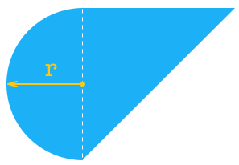

计算以下面这个形状为底面的柱体的表面积。

  

这个柱体的下底面由一个等腰直角三角形和一个半圆组成，等腰三角形的直角边和半圆的直径相等。

现在，已知底面半圆的半径为 r，柱体的高是 h。请求出这个柱体的表面积。

#### 提示

-   柱体的总表面积可由两底面的面积加上侧面面积获得；
-   侧面积可由通过求底面周长乘以柱体的高 h 获得；
-   圆的周长公式为 2πr，面积公式为 πr2；
-   直角三角形的斜边长计算可以利用勾股定理：直角边平方的和等于斜边的平方；
-   π 取 3.14。

#### 输入

由空格分隔的两个实数，分别是底面半圆的半径 r 和柱体的高 h（1.0≤r, h<100.0）。

#### 输出

输出为一行，是柱体的表面积的 10000 倍，只保留整数部分（四舍五入）。

___

#### 输入样例复制

```
1 2
```

#### 输出样例复制

```
230769
```